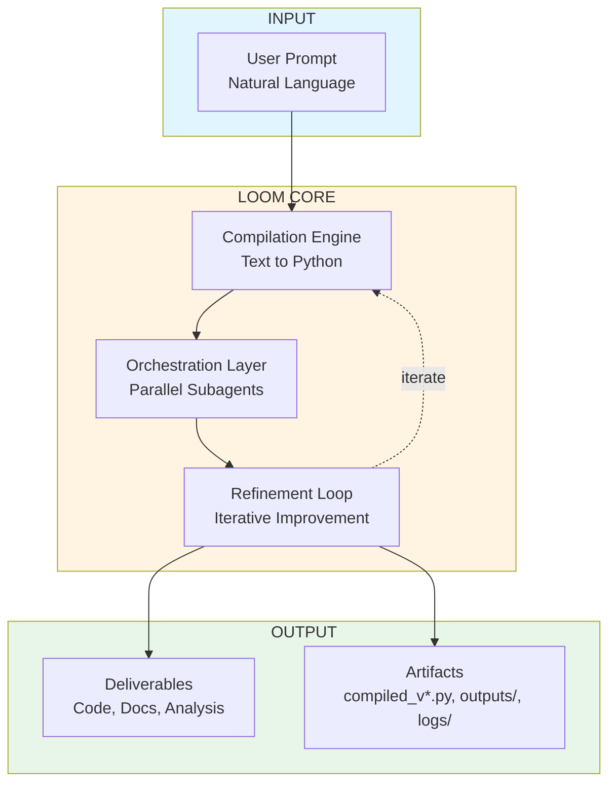
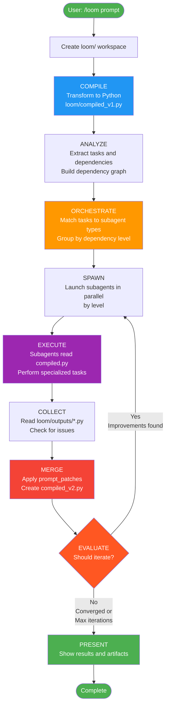
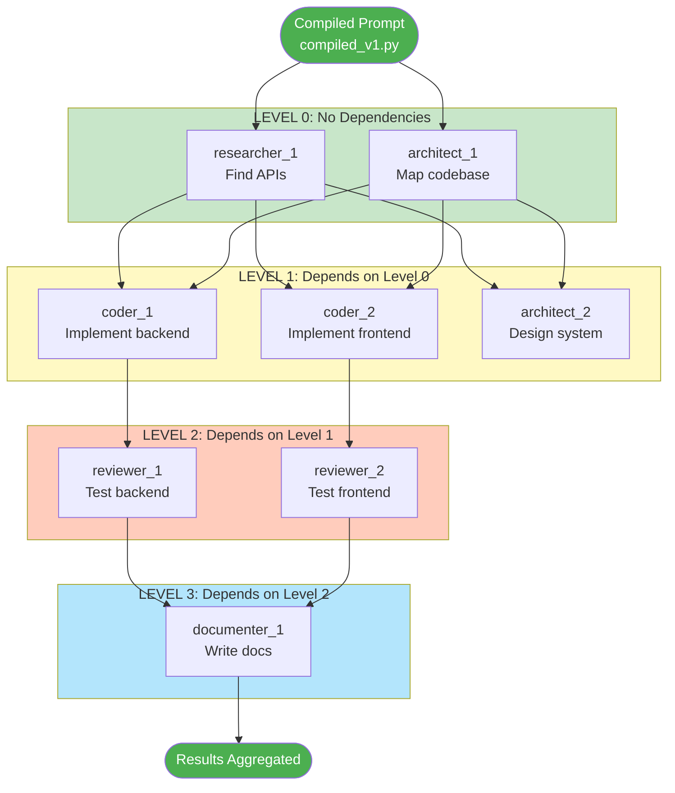
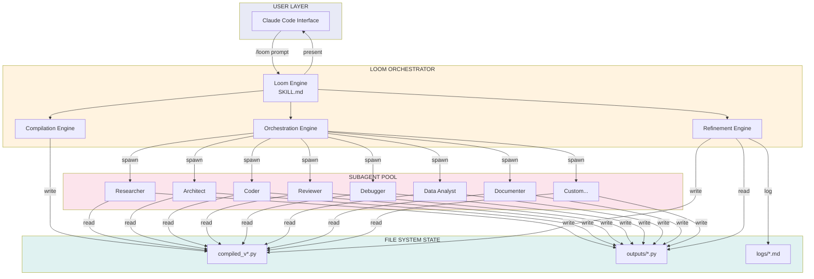
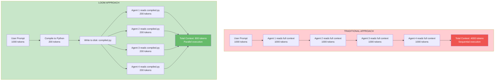
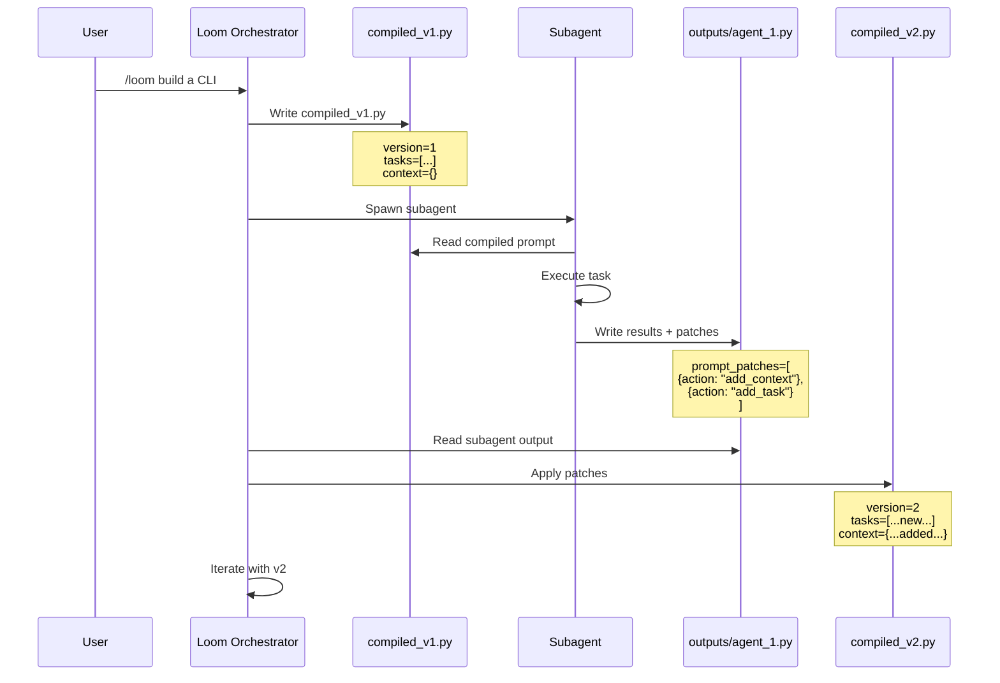
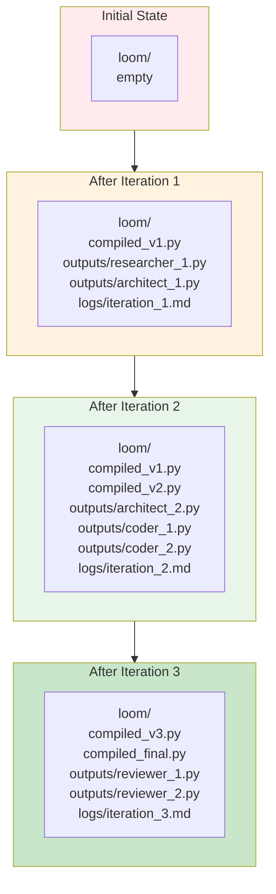

# Loom Visual Diagrams

Visual reference for how Loom works. These diagrams are in Mermaid format and render on GitHub.

For the technical explanation behind these diagrams, see [ARCHITECTURE.md](ARCHITECTURE.md).

---

## Table of Contents

- [High-Level Overview](#high-level-overview)
- [Detailed Process Flow](#detailed-process-flow)
- [Parallel Execution Model](#parallel-execution-model)
- [System Architecture](#system-architecture)
- [Iteration Timeline](#iteration-timeline)
- [Data Flow Through Iterations](#data-flow-through-iterations)
- [Context Efficiency Comparison](#context-efficiency-comparison)
- [Patch-Based Refinement](#patch-based-refinement)
- [File System State Evolution](#file-system-state-evolution)

---

## High-Level Overview

---

## Detailed Process Flow

The 7-step process that Loom follows for every invocation. See [ARCHITECTURE.md - Core Architecture](ARCHITECTURE.md#core-architecture) for implementation details.

---

## Parallel Execution Model

Tasks are grouped by dependency level. All tasks at the same level run concurrently. See [ARCHITECTURE.md - Orchestration Layer](ARCHITECTURE.md#orchestration-layer) for the scheduling algorithm.

---

## System Architecture

How the orchestrator, file system, and subagent pool interact. See [ARCHITECTURE.md - Core Architecture](ARCHITECTURE.md#core-architecture).

---

## Iteration Timeline

Example timeline showing how parallelization saves time compared to sequential execution.

```mermaid
gantt
    title Loom Execution Timeline (Weather Dashboard)
    dateFormat X
    axisFormat %M:%S

    section Iteration 1
    Compile v1           :done, c1, 0, 30s
    Spawn researcher     :done, s1, after c1, 5min
    Spawn architect      :done, s2, after s1, 5min
    Collect results      :done, col1, after s2, 30s
    Merge patches to v2  :done, m1, after col1, 30s

    section Iteration 2
    Spawn architect      :done, s3, after m1, 5min
    Spawn coders (parallel) :done, s4, after s3, 5min
    Collect results      :done, col2, after s4, 30s
    Merge patches to v3  :done, m2, after col2, 30s

    section Iteration 3
    Spawn reviewers (parallel) :done, s5, after m2, 5min
    Collect results      :done, col3, after s5, 30s
    Converged - Present  :done, pres, after col3, 1min
```

---

## Data Flow Through Iterations

How the compiled prompt evolves from vague to validated across 3 iterations.

```mermaid
graph LR
    subgraph Iteration1["ITERATION 1: Discovery"]
        I1_Input["User Prompt<br/>(vague)"]
        I1_Compiled["compiled_v1.py<br/>2 tasks<br/>minimal context"]
        I1_Outputs["outputs/<br/>researcher_1.py<br/>architect_1.py"]
        I1_Issues["Issues:<br/>- Missing requirements<br/>- Vague specs"]

        I1_Input --> I1_Compiled
        I1_Compiled --> I1_Outputs
        I1_Outputs --> I1_Issues
    end

    subgraph Iteration2["ITERATION 2: Implementation"]
        I2_Compiled["compiled_v2.py<br/>4 tasks<br/>+ API context<br/>+ tech stack"]
        I2_Outputs["outputs/<br/>architect_2.py<br/>coder_1.py<br/>coder_2.py"]
        I2_Issues["Issues:<br/>- Missing tests"]

        I2_Compiled --> I2_Outputs
        I2_Outputs --> I2_Issues
    end

    subgraph Iteration3["ITERATION 3: Validation"]
        I3_Compiled["compiled_v3.py<br/>2 tasks<br/>+ test requirements"]
        I3_Outputs["outputs/<br/>reviewer_1.py<br/>reviewer_2.py"]
        I3_Done["All tests pass<br/>No new patches<br/>CONVERGED"]

        I3_Compiled --> I3_Outputs
        I3_Outputs --> I3_Done
    end

    I1_Issues -.patches.-> I2_Compiled
    I2_Issues -.patches.-> I3_Compiled

    style I1_Input fill:#ffcdd2
    style I1_Issues fill:#ffcdd2
    style I2_Issues fill:#fff9c4
    style I3_Done fill:#c8e6c9
```

---

## Context Efficiency Comparison

Why compilation matters: traditional approach duplicates context across every agent. Loom writes state to disk once and agents read it independently.

---

## Patch-Based Refinement

How subagents suggest improvements to the compiled prompt through structured patches. See [ARCHITECTURE.md - Refinement Loop](ARCHITECTURE.md#refinement-loop).

---

## File System State Evolution

How the `loom/` workspace grows across iterations.

---

## Related Documentation

- [README.md](README.md) - Overview and quick start
- [ARCHITECTURE.md](ARCHITECTURE.md) - Technical details behind these diagrams
- [SKILL.md](SKILL.md) - The skill definition (operational reference)
- [examples/](examples/) - Worked examples showing these flows in action
