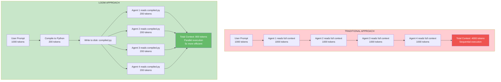
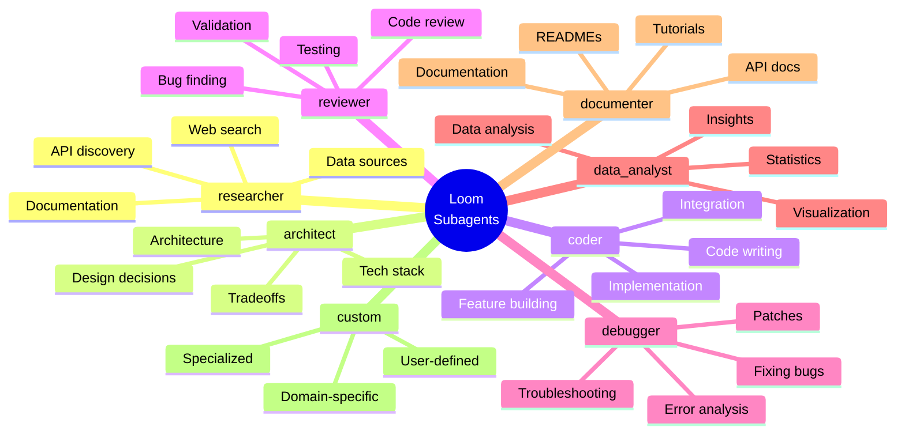

# Loom Visual Diagrams

This document contains visual diagrams explaining how Loom works.

---

## High-Level Overview

```mermaid
flowchart TB
    subgraph Input["📝 INPUT"]
        A[User Prompt<br/>Natural Language]
    end

    subgraph Core["🧵 LOOM CORE CAPABILITIES"]
        B[🐍 Compilation Engine<br/>Text → Python]
        C[🤖 Orchestration Layer<br/>Parallel Subagents]
        D[🔄 Refinement Loop<br/>Iterative Improvement]
    end

    subgraph Output["📦 OUTPUT"]
        E[Deliverables<br/>Code, Docs, Analysis]
        F[Artifacts<br/>compiled_v*.py, outputs/, logs/]
    end

    A --> B
    B --> C
    C --> D
    D --> E
    D --> F
    D -.iterate.-> B

    style Input fill:#e1f5ff
    style Core fill:#fff4e1
    style Output fill:#e8f5e9
    style B fill:#bbdefb
    style C fill:#c5e1a5
    style D fill:#ffccbc
```

---

## Detailed Process Flow

```mermaid
flowchart TD
    Start([User: /loom build a CLI]) --> Setup[Create loom/ workspace]

    Setup --> Compile[🐍 COMPILE<br/>Transform to Python<br/>loom/compiled_v1.py]

    Compile --> Analyze[🧠 ANALYZE<br/>Extract tasks & dependencies<br/>Build dependency graph]

    Analyze --> Orchestrate[🎯 ORCHESTRATE<br/>Match tasks to subagent types<br/>Group by dependency level]

    Orchestrate --> Spawn[🚀 SPAWN<br/>Launch subagents in parallel<br/>by level]

    Spawn --> Execute[⚙️ EXECUTE<br/>Subagents read compiled.py<br/>Perform specialized tasks]

    Execute --> Collect[📥 COLLECT<br/>Read loom/outputs/*.py<br/>Check for issues]

    Collect --> Merge[🔀 MERGE<br/>Apply prompt_patches<br/>Create compiled_v2.py]

    Merge --> Evaluate{🤔 EVALUATE<br/>Should iterate?}

    Evaluate -->|Yes<br/>Improvements found| Spawn
    Evaluate -->|No<br/>Converged or<br/>Max iterations| Present[🎉 PRESENT<br/>Show results & artifacts]

    Present --> End([✓ Complete])

    style Start fill:#4CAF50,color:#fff
    style End fill:#4CAF50,color:#fff
    style Compile fill:#2196F3,color:#fff
    style Orchestrate fill:#FF9800,color:#fff
    style Execute fill:#9C27B0,color:#fff
    style Merge fill:#F44336,color:#fff
    style Evaluate fill:#FF5722,color:#fff
    style Present fill:#4CAF50,color:#fff
```

---

## Three Core Capabilities

```mermaid
graph TB
    subgraph Compilation["🐍 PROMPT-TO-PYTHON COMPILATION"]
        C1[Natural Language Prompt]
        C2[Parse Intent & Goals]
        C3[Decompose into Tasks]
        C4[Build Dependency Graph]
        C5[Extract Context & Constraints]
        C6[Python Representation<br/>class CompiledPrompt]

        C1 --> C2 --> C3 --> C4 --> C5 --> C6
    end

    subgraph Orchestration["🤖 PARALLEL SUBAGENT ORCHESTRATION"]
        O1[Read compiled.py]
        O2[Match Tasks to Subagents<br/>researcher, architect, coder, etc.]
        O3[Schedule by Dependency Level<br/>Level 0, 1, 2...]
        O4[Spawn in Parallel]
        O5[Aggregate Results]

        O1 --> O2 --> O3 --> O4 --> O5
    end

    subgraph Refinement["🔄 RECURSIVE REFINEMENT LOOP"]
        R1[Iteration N]
        R2[Subagents Suggest Patches]
        R3[Apply Patches]
        R4[compiled_vN+1.py]
        R5{Converged?}

        R1 --> R2 --> R3 --> R4 --> R5
        R5 -->|No| R1
        R5 -->|Yes| R6[Final Results]
    end

    C6 --> O1
    O5 --> R1

    style Compilation fill:#e3f2fd
    style Orchestration fill:#f3e5f5
    style Refinement fill:#fff3e0
```

---

## Parallel Execution Model

---

## System Architecture

```mermaid
graph TB
    subgraph User["👤 USER LAYER"]
        UI[Claude Code Interface]
    end

    subgraph Orchestrator["🧵 LOOM ORCHESTRATOR"]
        LE[Loom Engine<br/>SKILL.md]
        CE[Compilation Engine]
        OE[Orchestration Engine]
        RE[Refinement Engine]

        LE --> CE
        LE --> OE
        LE --> RE
    end

    subgraph FileSystem["💾 FILE SYSTEM STATE"]
        FS1[compiled_v*.py]
        FS2[outputs/*.py]
        FS3[logs/*.md]
    end

    subgraph Subagents["🤖 SUBAGENT POOL"]
        SA1[Researcher]
        SA2[Architect]
        SA3[Coder]
        SA4[Reviewer]
        SA5[Debugger]
        SA6[Data Analyst]
        SA7[Documenter]
        SA8[Custom...]
    end

    UI -->|/loom prompt| LE

    CE -->|write| FS1
    OE -->|spawn| SA1 & SA2 & SA3 & SA4 & SA5 & SA6 & SA7 & SA8
    SA1 & SA2 & SA3 & SA4 & SA5 & SA6 & SA7 & SA8 -->|read| FS1
    SA1 & SA2 & SA3 & SA4 & SA5 & SA6 & SA7 & SA8 -->|write| FS2
    RE -->|read| FS2
    RE -->|write| FS1
    RE -->|log| FS3

    LE -->|present| UI

    style User fill:#e8eaf6
    style Orchestrator fill:#fff3e0
    style FileSystem fill:#e0f2f1
    style Subagents fill:#fce4ec
```

---

## Iteration Timeline Example

---

## Data Flow Through Iterations

```mermaid
graph LR
    subgraph Iteration1["ITERATION 1: Discovery"]
        I1_Input["User Prompt<br/>(vague)"]
        I1_Compiled["compiled_v1.py<br/>2 tasks<br/>minimal context"]
        I1_Outputs["outputs/<br/>researcher_1.py<br/>architect_1.py"]
        I1_Issues["Issues:<br/>- Missing requirements<br/>- Vague specs"]

        I1_Input --> I1_Compiled
        I1_Compiled --> I1_Outputs
        I1_Outputs --> I1_Issues
    end

    subgraph Iteration2["ITERATION 2: Implementation"]
        I2_Compiled["compiled_v2.py<br/>4 tasks<br/>+ API context<br/>+ tech stack"]
        I2_Outputs["outputs/<br/>architect_2.py<br/>coder_1.py<br/>coder_2.py"]
        I2_Issues["Issues:<br/>- Missing tests"]

        I2_Compiled --> I2_Outputs
        I2_Outputs --> I2_Issues
    end

    subgraph Iteration3["ITERATION 3: Validation"]
        I3_Compiled["compiled_v3.py<br/>2 tasks<br/>+ test requirements"]
        I3_Outputs["outputs/<br/>reviewer_1.py<br/>reviewer_2.py"]
        I3_Done["✓ All tests pass<br/>✓ No new patches<br/>→ CONVERGED"]

        I3_Compiled --> I3_Outputs
        I3_Outputs --> I3_Done
    end

    I1_Issues -.patches.-> I2_Compiled
    I2_Issues -.patches.-> I3_Compiled

    style I1_Input fill:#ffcdd2
    style I1_Issues fill:#ffcdd2
    style I2_Issues fill:#fff9c4
    style I3_Done fill:#c8e6c9
```

---

## Context Efficiency Comparison

---

## Subagent Registry

---

## Patch-Based Refinement

```mermaid
sequenceDiagram
    participant U as User
    participant L as Loom Orchestrator
    participant C as compiled_v1.py
    participant S as Subagent
    participant O as outputs/agent_1.py
    participant C2 as compiled_v2.py

    U->>L: /loom build a CLI
    L->>C: Write compiled_v1.py
    Note over C: version=1<br/>tasks=[...]<br/>context={}

    L->>S: Spawn subagent
    S->>C: Read compiled prompt
    S->>S: Execute task
    S->>O: Write results + patches
    Note over O: prompt_patches=[<br/>  {action: "add_context"},<br/>  {action: "add_task"}<br/>]

    L->>O: Read subagent output
    L->>C2: Apply patches → compiled_v2.py
    Note over C2: version=2<br/>tasks=[...new...]<br/>context={...added...}

    L->>L: Iterate with v2
```

---

## File System State Evolution

```mermaid
graph TD
    subgraph Init["Initial State"]
        I1[loom/<br/>empty]
    end

    subgraph After_I1["After Iteration 1"]
        A1[loom/<br/>├─ compiled_v1.py<br/>├─ outputs/<br/>│  ├─ researcher_1.py<br/>│  └─ architect_1.py<br/>└─ logs/<br/>   └─ iteration_1.md]
    end

    subgraph After_I2["After Iteration 2"]
        A2[loom/<br/>├─ compiled_v1.py<br/>├─ compiled_v2.py ⭐<br/>├─ outputs/<br/>│  ├─ researcher_1.py<br/>│  ├─ architect_1.py<br/>│  ├─ architect_2.py ⭐<br/>│  ├─ coder_1.py ⭐<br/>│  └─ coder_2.py ⭐<br/>└─ logs/<br/>   ├─ iteration_1.md<br/>   └─ iteration_2.md ⭐]
    end

    subgraph After_I3["After Iteration 3"]
        A3[loom/<br/>├─ compiled_v1.py<br/>├─ compiled_v2.py<br/>├─ compiled_v3.py ⭐<br/>├─ compiled_final.py ⭐<br/>├─ outputs/<br/>│  ├─ researcher_1.py<br/>│  ├─ architect_1.py<br/>│  ├─ architect_2.py<br/>│  ├─ coder_1.py<br/>│  ├─ coder_2.py<br/>│  ├─ reviewer_1.py ⭐<br/>│  └─ reviewer_2.py ⭐<br/>└─ logs/<br/>   ├─ iteration_1.md<br/>   ├─ iteration_2.md<br/>   └─ iteration_3.md ⭐]
    end

    Init --> After_I1
    After_I1 --> After_I2
    After_I2 --> After_I3

    style Init fill:#ffebee
    style After_I1 fill:#fff3e0
    style After_I2 fill:#e8f5e9
    style After_I3 fill:#c8e6c9
```

---

These diagrams are in Mermaid format and will render beautifully on GitHub!
