# Loom - Recursive Prompt Refinement for Claude Code

**A meta-prompt system that compiles natural language prompts into Python, orchestrates parallel subagent execution, and iteratively refines through automated feedback loops.**

[](https://opensource.org/licenses/MIT)

---

## What is Loom?

Loom transforms how you work with complex prompts in Claude Code by providing three powerful capabilities that work together:

### 🐍 1. Prompt-to-Python Compilation
Converts natural language prompts into structured Python representations:
- **Structured data** replacing ambiguous text
- **Version controlled** alongside your codebase
- **Analyzable** for dependencies and task relationships
- **Reusable** across different contexts
- **Zero context overhead** - subagents read compiled state from disk

### 🤖 2. Parallel Subagent Orchestration
Distributes compiled tasks to specialized subagents for execution:
- **Multiple subagents** work simultaneously on independent tasks
- **Specialized roles** (researcher, architect, coder, reviewer, etc.)
- **Dependency-aware** scheduling with multi-level execution
- **Result aggregation** synthesized into comprehensive output
- **3x+ faster** through parallelization

### 🔄 3. Recursive Refinement Loop
Iteratively improves prompts through automated feedback (up to 3 iterations):
- **Compile** → Execute → Collect → Merge → Iterate
- **Automatic learning** from each iteration
- **Progressive improvement** of prompt quality
- **Patch-based updates** suggested by subagents
- **Convergence detection** stops when optimal

---

## How It Works

> 📊 **See [DIAGRAMS.md](DIAGRAMS.md) for comprehensive visual diagrams!**

```mermaid
flowchart TD
    Start([👤 User: /loom build a CLI]) --> Setup[📁 Create loom/ workspace]

    Setup --> Compile[🐍 COMPILE<br/>Transform to Python<br/>→ loom/compiled_v1.py]

    Compile --> Analyze[🧠 ANALYZE<br/>Extract tasks & dependencies<br/>Build dependency graph]

    Analyze --> Orchestrate[🎯 ORCHESTRATE<br/>Match tasks to subagent types<br/>Group by dependency level]

    Orchestrate --> Spawn[🚀 SPAWN<br/>Launch subagents in parallel<br/>by level]

    Spawn --> Execute[⚙️ EXECUTE<br/>Subagents read compiled.py<br/>Perform specialized tasks]

    Execute --> Collect[📥 COLLECT<br/>Read loom/outputs/*.py<br/>Check for issues]

    Collect --> Merge[🔀 MERGE<br/>Apply prompt_patches<br/>→ compiled_v2.py]

    Merge --> Evaluate{🤔 EVALUATE<br/>Should iterate?}

    Evaluate -->|✓ Yes<br/>Improvements found| Spawn
    Evaluate -->|✗ No<br/>Converged or max iterations| Present[🎉 PRESENT<br/>Show results & artifacts]

    Present --> End([✅ Complete])

    style Start fill:#4CAF50,color:#fff,stroke:#2E7D32,stroke-width:3px
    style End fill:#4CAF50,color:#fff,stroke:#2E7D32,stroke-width:3px
    style Compile fill:#2196F3,color:#fff,stroke:#1565C0,stroke-width:2px
    style Orchestrate fill:#FF9800,color:#fff,stroke:#E65100,stroke-width:2px
    style Execute fill:#9C27B0,color:#fff,stroke:#6A1B9A,stroke-width:2px
    style Merge fill:#F44336,color:#fff,stroke:#C62828,stroke-width:2px
    style Evaluate fill:#FF5722,color:#fff,stroke:#D84315,stroke-width:2px
    style Present fill:#4CAF50,color:#fff,stroke:#2E7D32,stroke-width:2px
```



### The 7-Step Process

1. **COMPILE** - Transform natural language into structured Python
2. **ANALYZE** - Extract tasks and build dependency graph
3. **ORCHESTRATE** - Match tasks to specialized subagent types
4. **SPAWN** - Launch subagents in parallel (by dependency level)
5. **EXECUTE** - Subagents read compiled state and perform work
6. **COLLECT** - Gather results and check for issues
7. **MERGE** - Apply patches to create next iteration

**Then:** Evaluate if iteration improved things. If yes, iterate with refined prompt. If converged or max iterations reached, present final results.

---

## Installation

### Quick Start

1. **Copy the skill file to your Claude Code skills directory:**
   ```bash
   # Global installation (available in all projects)
   cp SKILL.md ~/.claude/skills/loom.md

   # OR: Project-specific installation
   mkdir -p .claude/skills
   cp SKILL.md .claude/skills/loom.md
   ```

2. **Reload skills in Claude Code:**
   ```
   /skills reload
   ```

3. **Verify installation:**
   ```
   /skills list
   ```
   You should see `loom` in the available skills list.

---

## Usage

### Basic Invocation

Invoke loom using the `/loom` command followed by your prompt:

```
/loom build a CLI that fetches crypto prices
```

Or ask Claude to use loom:

```
Use loom to analyze this codebase for security vulnerabilities
```

### What Happens Next

1. **Loom creates workspace:**
   ```
   loom/
   ├── compiled_v1.py
   ├── outputs/
   └── logs/
   ```

2. **Compiles your prompt** into structured Python with tasks, intent, and context

3. **Spawns specialized subagents** in parallel to execute tasks

4. **Collects results** and applies improvements

5. **Iterates** up to 3 times for refinement

6. **Presents final results** with all artifacts saved

---

## When to Use Loom

### ✅ Use Loom When:

- **Complex multi-step tasks** that can be broken down into subtasks
- **Research + implementation** workflows (find info → design → build → test)
- **Parallel execution** would speed things up (independent tasks)
- **Iterative refinement** would improve quality
- **You want artifacts** saved for inspection/debugging
- **Prompt engineering** - testing and optimizing prompts
- **Large codebases** requiring multiple specialized agents

### ❌ Skip Loom For:

- **Simple one-shot prompts** (single file edits, basic queries)
- **Purely sequential** tasks that can't be parallelized
- **Quick throwaway** questions or clarifications
- **Already well-defined** prompts that don't need refinement
- **When you need immediate** results (loom has overhead from compilation)

---

## Examples

### Example 1: Build a CLI Application

**Input:**
```
/loom build a CLI that fetches current crypto prices and displays them
```

**What Loom Does:**

**Iteration 1:**
- ✓ Compiles prompt → `loom/compiled_v1.py`
  - Tasks: research_apis, design_cli, implement, test
- ✓ Spawns researcher (parallel)
  - Discovers CoinGecko API is best option
  - Returns: API endpoints, rate limits, example responses
  - Patches: Add "api_choice": "CoinGecko" to context

**Iteration 2:**
- ✓ Recompiles with API context → `compiled_v2.py`
- ✓ Spawns architect
  - Designs CLI structure with argparse
  - Returns: File structure, module breakdown
- ✓ Spawns coder (parallel with architect completion)
  - Implements CLI with CoinGecko integration
  - Returns: crypto_cli.py, requirements.txt

**Iteration 3:**
- ✓ Spawns reviewer
  - Tests the CLI, finds edge case (missing error handling)
  - Returns: Issues list with severity
- ✓ Spawns debugger + coder (parallel)
  - Fix error handling
  - Add retry logic
  - Returns: Patches

**Final Results:**
```
📦 DELIVERABLES:
- crypto_cli.py (working CLI)
- requirements.txt
- All research saved in loom/outputs/
- Evolution logged in loom/logs/
```

---

### Example 2: Security Audit

**Input:**
```
/loom perform comprehensive security audit of the authentication system
```

**What Loom Does:**

**Iteration 1:**
- ✓ Compiles → Identifies auth-related files
- ✓ Spawns 3 parallel reviewers:
  - Reviewer A: Authentication flow analysis
  - Reviewer B: Input validation review
  - Reviewer C: Dependency vulnerability scan
- ✓ Aggregates findings → 12 issues found

**Iteration 2:**
- ✓ Recompiles with issue context
- ✓ Spawns specialized debuggers for critical issues
- ✓ Prioritizes vulnerabilities by severity

**Final Results:**
```
📦 DELIVERABLES:
- Security audit report with 12 findings
- 3 critical, 5 medium, 4 low severity
- Recommended fixes for each issue
- Updated compiled prompt documents the audit process
```

**Time saved:** 3x faster than sequential analysis

---

### Example 3: Refactoring

**Input:**
```
/loom refactor the API layer to use async/await patterns
```

**Iteration 1:**
- Analyzes codebase
- Identifies all sync functions
- Maps dependencies

**Iteration 2:**
- Generates async versions
- Updates function signatures
- Parallel test execution

**Iteration 3:**
- Reviews for consistency
- Fixes edge cases
- Validates all tests pass

---

## Subagent Types

Loom has 7 built-in subagent types that are automatically selected based on task requirements:

```mermaid
mindmap
  root((🧵 Loom<br/>Subagents))
    🔍 researcher
      Web search
      API discovery
      Documentation
      Data sources
    🏗️ architect
      Design decisions
      Tech stack choices
      Architecture
      Tradeoffs
    👨‍💻 coder
      Implementation
      Code writing
      Feature building
      Integration
    ✅ reviewer
      Code review
      Testing
      Validation
      Bug finding
    🐛 debugger
      Error analysis
      Fixing bugs
      Troubleshooting
      Patches
    📊 data_analyst
      Data analysis
      Statistics
      Visualization
      Insights
    📝 documenter
      Documentation
      Tutorials
      READMEs
      API docs
    ⚙️ custom
      User-defined
      Specialized tasks
      Domain-specific
```



### Subagent Capabilities

| Type | Good For | Returns |
|------|----------|---------|
| **🔍 researcher** | Finding information, web research, API discovery | Structured data with sources |
| **🏗️ architect** | Design decisions, choosing approaches, tech stack | Design decisions with reasoning |
| **👨‍💻 coder** | Implementing features, writing code | Code files or implementations |
| **✅ reviewer** | Checking correctness, finding bugs, validation | Issues list with severity + patches |
| **📊 data_analyst** | Analyzing datasets, statistics, insights | Analysis results with visualizations |
| **📝 documenter** | Writing docs, tutorials, READMEs | Documentation files |
| **🐛 debugger** | Fixing broken code, error analysis | Patches and fixes |

**⚙️ Custom Subagents:** Loom can also create custom subagents on-the-fly for specialized tasks not covered by built-in types.

---

## Advanced Usage

### Continuing from Previous State

If `loom/` directory exists from a previous run:

```
Loom detected previous state. Options:
1. Clean and start fresh
2. Continue from previous iteration
```

Loom will ask which approach you prefer.

### Inspecting Artifacts

All loom artifacts are saved for inspection:

```bash
# View compiled prompt evolution
cat loom/compiled_v1.py
cat loom/compiled_v2.py
cat loom/compiled_v3.py

# View subagent outputs
cat loom/outputs/researcher_1.py
cat loom/outputs/coder_1.py

# Read iteration logs
cat loom/logs/iteration_1.md
cat loom/logs/iteration_2.md
```

### Debugging Failed Runs

If a subagent fails:
1. Check `loom/outputs/{{role}}_{{N}}.py` for `completed = False`
2. Read the `issues` list for blocking problems
3. Review `loom/logs/iteration_{{N}}.md` for detailed log

### Customizing Iterations

Loom runs up to 3 iterations by default, but will stop early if:
- All tasks completed successfully
- No new patches suggested
- Prompt has converged (no changes between versions)

---

## Project Structure

After a loom session, you'll have:

```
loom/
├── compiled_v1.py          # Initial compilation
├── compiled_v2.py          # After iteration 1
├── compiled_v3.py          # After iteration 2 (if needed)
├── compiled_final.py       # Copy of best version
│
├── outputs/
│   ├── researcher_1.py     # Subagent outputs
│   ├── architect_1.py
│   ├── coder_1.py
│   ├── coder_2.py
│   └── reviewer_1.py
│
└── logs/
    ├── iteration_1.md      # Detailed iteration logs
    ├── iteration_2.md
    └── iteration_3.md
```

---

## Core Principles

### Context Efficiency Through Compilation

```mermaid
graph TB
    subgraph Traditional["❌ TRADITIONAL APPROACH"]
        T1[User Prompt<br/>1000 tokens]
        T2[Agent 1 reads full context<br/>1000 tokens]
        T3[Agent 2 reads full context<br/>1000 tokens]
        T4[Agent 3 reads full context<br/>1000 tokens]
        T5[Agent 4 reads full context<br/>1000 tokens]
        T_Total["Total: 4000 tokens<br/>Sequential execution<br/>❌ Expensive"]

        T1 --> T2 --> T3 --> T4 --> T5 --> T_Total
    end

    subgraph Loom["✅ LOOM APPROACH"]
        L1[User Prompt<br/>1000 tokens]
        L2[🐍 Compile to Python<br/>200 tokens]
        L3[💾 Write to disk<br/>compiled.py]
        L4[Agent 1 reads compiled.py<br/>200 tokens]
        L5[Agent 2 reads compiled.py<br/>200 tokens]
        L6[Agent 3 reads compiled.py<br/>200 tokens]
        L7[Agent 4 reads compiled.py<br/>200 tokens]
        L_Total["Total: 800 tokens<br/>⚡ Parallel execution<br/>✅ 5x more efficient"]

        L1 --> L2 --> L3
        L3 --> L4 & L5 & L6 & L7
        L4 & L5 & L6 & L7 --> L_Total
    end

    style Traditional fill:#ffcdd2,stroke:#c62828,stroke-width:2px
    style Loom fill:#c8e6c9,stroke:#2e7d32,stroke-width:2px
    style T_Total fill:#ef5350,color:#fff,stroke:#c62828,stroke-width:3px
    style L_Total fill:#66bb6a,color:#fff,stroke:#2e7d32,stroke-width:3px
```



**Traditional approach:**
- Human writes natural language (their strength)
- Claude reads everything in context (expensive)
- Limited by context window
- Sequential execution

**Loom approach:**
- Human writes natural language (their strength)
- Loom compiles to structured Python (Claude's strength)
- Subagents read compiled state from disk (zero context overhead)
- Subagents return code, not prose (efficient)
- Parallel execution by default

### Code Over Prose

Loom enforces structured outputs:
- Subagents return Python classes, not markdown
- Results are parseable and mergeable
- Patches are explicit and actionable

### Parallelization by Default

Loom aggressively parallelizes:
- Tasks with no dependencies run simultaneously
- Multi-level execution based on dependency graph
- Significantly faster than sequential execution

### Trust the Process

- **v1** is rough - discovers requirements
- **v2** implements with more context
- **v3** polishes and validates
- Each iteration improves on the last through automated feedback

---

## Requirements

- **Claude Code** (latest version recommended)
- No external dependencies required
- Works with all Claude models (Sonnet/Opus recommended for best results)

---

## Why Loom?


### Traditional Prompting
- ❌ Single-threaded execution
- ❌ Manual iteration (slow)
- ❌ Prompts discarded after use
- ❌ Context window limits complexity
- ❌ No record of refinement process

### Loom Approach
- ✅ Multi-threaded execution (3-5x faster)
- ✅ Automated iteration with convergence detection
- ✅ Prompts saved as version-controlled Python
- ✅ Minimal context overhead (disk-based state)
- ✅ Complete audit trail of refinement process

---

## Best Practices

1. **Compile thoroughly** - A good compiled prompt = good subagent results
2. **Parallelize aggressively** - Spawn all independent tasks at once
3. **Trust the process** - Let subagents discover improvements through patches
4. **Embrace iteration** - v1 is rough, v3 is refined
5. **Code over prose** - Always request structured Python outputs
6. **Minimal context** - Subagents read from files, not from prompts
7. **Show your work** - User sees the refinement process in logs

---

## Contributing

Contributions are welcome! Ways to contribute:

- **Report bugs** via [GitHub Issues](../../issues)
- **Submit feature requests** for new subagent types or capabilities
- **Share examples** of interesting loom workflows
- **Improve documentation** with clarifications or examples
- **Suggest optimizations** to the compilation or orchestration logic

See [CONTRIBUTING.md](CONTRIBUTING.md) for detailed guidelines.

---

## License

MIT License - see [LICENSE](LICENSE) file for details.

Free to use, modify, and distribute. Attribution appreciated but not required.

---

## Learn More

- **[DIAGRAMS.md](DIAGRAMS.md)** - 📊 Visual diagrams and flowcharts
- **[ARCHITECTURE.md](ARCHITECTURE.md)** - Deep dive into loom's internals
- **[examples/](examples/)** - Detailed examples and use cases
- **[CHANGELOG.md](CHANGELOG.md)** - Version history and updates

---

## Success Metrics

Loom is working well when:
- ✓ Iteration 1 discovers missing requirements
- ✓ Iteration 2 implements with more context
- ✓ Iteration 3 polishes and validates
- ✓ Final deliverables are concrete and correct
- ✓ User sees clear improvement from v1 → v3
- ✓ Artifacts saved for future reference

---

## Support

- **Documentation:** [README.md](README.md), [ARCHITECTURE.md](ARCHITECTURE.md)
- **Examples:** [examples/](examples/)
- **Issues:** [GitHub Issues](../../issues)
- **Discussions:** [GitHub Discussions](../../discussions)

---

**Built for the [Claude Code](https://github.com/anthropics/claude-code) community.**

*Transform your prompts from throw-away text to version-controlled, parallelized, self-refining Python programs.*
